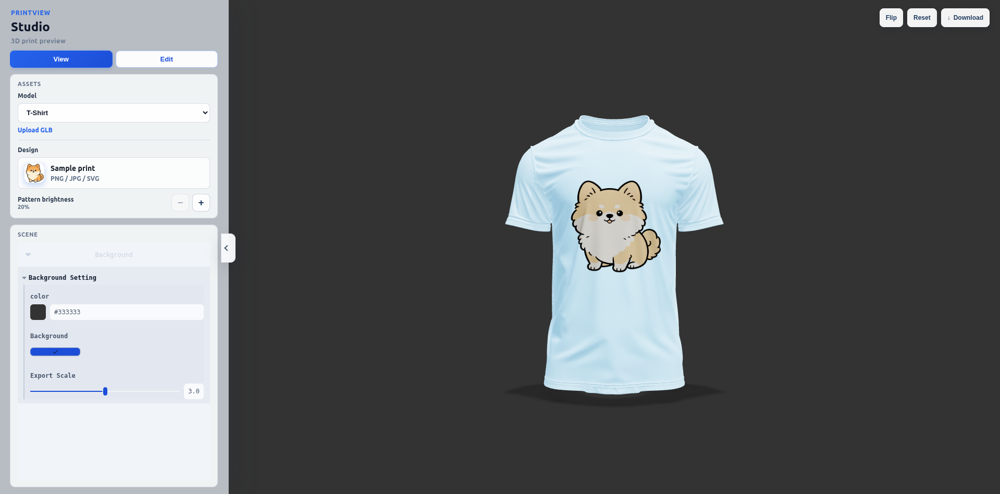
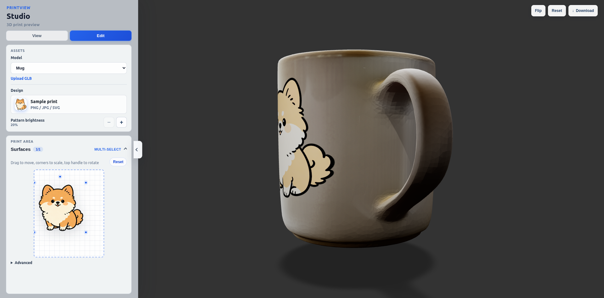

# PrintView Studio

**[Live Demo](https://print-view-studio.vercel.app/)** · Browser-based 3D print mockup editor

> Preview artwork on garments and products in the browser — no server required.

Upload a PNG, JPG, or SVG, place it on a 3D model, and export a high-resolution mockup. PrintView Studio runs entirely in the browser: your designs and models stay on your device.

**Features**

- Built-in mockups: T-Shirt and Mug (`.glb` meshes from [TRELLIS.2-4B](https://huggingface.co/microsoft/TRELLIS.2-4B))
- Custom models: upload any `.glb` file
- Print-area editor: move, scale, rotate, and tune projection depth
- Surface-aware decals with fold fading for curved geometry
- Export PNG with solid or transparent background (2–4× resolution)

```bash
npm install
npm run dev
```

## Controls

### Sidebar

| Control | What it does |
|---------|----------------|
| **View** | Orbit the 3D scene. Background color can be changed in the Scene panel. |
| **Edit** | Open the print-area editor to position the design on the model. |
| **Model** | Switch between built-in models (T-Shirt, Mug) or an uploaded `.glb`. |
| **Upload GLB** | Load a custom 3D model from a `.glb` file. |
| **Design** | Upload a PNG, JPG, or SVG as the print artwork. |
| **Pattern brightness** `−` / `+` | Dim or brighten how the pattern appears on the model. |

### Edit mode

| Control | What it does |
|---------|----------------|
| **Surfaces** | Choose which mesh surfaces receive the print (multi-select). |
| **Print area** | Drag to move, corner handles to scale, top handle to rotate. |
| **Reset** | Restore the default print position for the current model. |
| **Advanced** | Fine-tune surface offset and projection depth. |

### Scene panel (View mode)

| Control | What it does |
|---------|----------------|
| **color** | Scene background color. |
| **Background** | Toggle a solid background in the viewport and export. |
| **Export Scale** | Resolution multiplier for PNG download (2–4×). |

### Top bar (3D viewport)

| Button | What it does |
|--------|----------------|
| **Flip** | Show the back of the model and mirror the print to the other side. |
| **Reset** | Return the camera to the front view of the current model. |
| **Download** | Export a high-res PNG. Transparent when Background is off. |

## Preview

**T-Shirt**



**Mug**



## Model sources

Built-in `.glb` models (`tshirt.glb`, `mug.glb`) were created with [microsoft/TRELLIS.2-4B](https://huggingface.co/microsoft/TRELLIS.2-4B) (MIT License).


| File | Role in PrintView Studio |
|------|--------------------------|
| `tshirt.glb` | Default apparel mockup surface |
| `mug.glb` | Product mockup surface (cylindrical print area) |

You can also upload your own `.glb` files (e.g. other assets generated with TRELLIS.2 or any compatible model).

**References**

- Model: [TRELLIS.2-4B on Hugging Face](https://huggingface.co/microsoft/TRELLIS.2-4B)
- Paper: [arXiv:2512.14692](https://arxiv.org/abs/2512.14692)
- Code: [microsoft/TRELLIS.2](https://github.com/microsoft/TRELLIS.2)

## Tech

React · Three.js · React Three Fiber · Redux Toolkit · Vite

## Acknowledgments

Based on [3D_Cloth_Mockup](https://github.com/Abhishek-00/3D_Cloth_Mockup) by [@Abhishek-00](https://github.com/Abhishek-00).

## License

This project is licensed under the [MIT License](LICENSE).

Built-in 3D models were created with [microsoft/TRELLIS.2-4B](https://huggingface.co/microsoft/TRELLIS.2-4B), which is also released under the MIT License.
